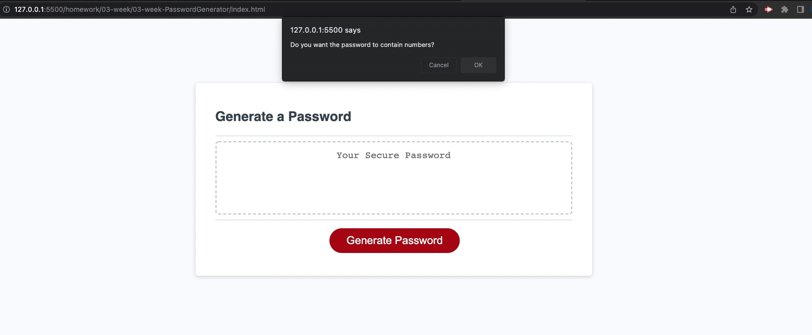

# Password_generator

Live URL: 

https://aescobar73.github.io/Password_generator/

Accepted Criteria

GIVEN I need a new, secure password
WHEN I click the button to generate a password
THEN I am presented with a series of prompts for password criteria
WHEN prompted for password criteria
THEN I select which criteria to include in the password
WHEN prompted for the length of the password
THEN I choose a length of at least 8 characters and no more than 128 characters
WHEN asked for character types to include in the password
THEN I confirm whether or not to include lowercase, uppercase, numeric, and/or special characters
WHEN I answer each prompt
THEN my input should be validated and at least one character type should be selected
WHEN all prompts are answered
THEN a password is generated that matches the selected criteria
WHEN the password is generated
THEN the password is either displayed in an alert or written to the page

For this exercise we were given the HTML, CSS and some JS to start out with. It was pretty difficult for me to find a starting point after declaring the variables, but after enough searching and googling for help, I was able to find a mix of code that I understood and I put it together to make it work.

In the following image you will see the prompt for us to input the length of the password.

The following shows if we want lower case letters;

Capital letters;

Numbers;

and Symbols;

Password Generated.

The following are links to references that were used to help write this app. Help was taken from each of these following links:

1) https://github.com/DariaNau/password-generator-js/blob/master/script.js
2) https://github.com/MaryKathryn0/Password-Generator/blob/master/script.js
3) https://www.youtube.com/watch?v=x4HUaiazDes&t=828s
4) https://w3collective.com/random-password-generator-javascript/
